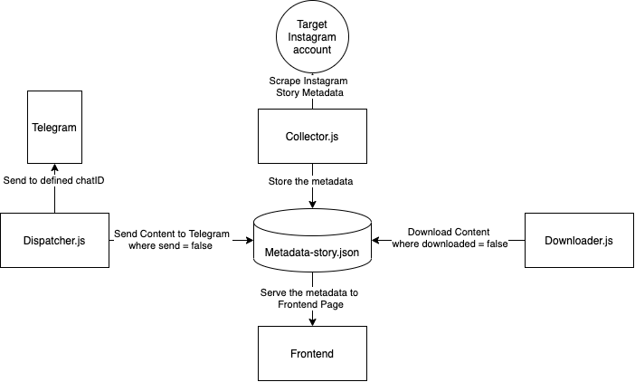

## Instagram Story Monitor
<!-- ALL-CONTRIBUTORS-BADGE:START - Do not remove or modify this section -->
[](#contributors-)
<!-- ALL-CONTRIBUTORS-BADGE:END -->
Monitor story your target instagram account & send to telegram on every update. This app also Inlcuding auto backup locally & frontend for local `metadata-story` explorer. 
## How To Use 📚
1. Clone this Repository
```
git clone https://github.com/2pai/instastory-monitor-telegram
```
2. Fill the .env file based on .env.example
```
cp .env.example .env
```
> Note: you can add more than one target in TARGET_USERNAME with comma separator without spaces (Example: instagram,facebook,google). for now there is no target limit, but keep in mind that the more targets the longer the process.
3. Install the dependency
```
npm install
```
4. Run the command in order
```bash
npm run collect  # collect instagram story metadata
npm run dispatch-telegram # dispatch / send instagram story to telegram
npm run dispatch-discord # dispatch / send instagram story to discord
npm run download # download content locally
npm run frontend # run the frontend to serve metadata

```
or simply by using `orchestrator.sh`
```bash
chmod +x ./orchestrator.sh
./orchestrator.sh
```

You can also run the orchestrator with CronJob to update the metadata & dispatch periodically.

## Architecture 🏹



### `collector.js`
This collector will be collecting instagram story metadata from instagram private api then compare it (with local metadata) & store/append it to `metadata-story.json`

The metadata structure will be 
```js
{
    username, // username target
    id, // uniquie id
    url, // url content
    mediaType, // 1 for image, 2 for video
    path, // path to store content locally, format yyyy/M/dd
    timestamp,
    send, // status dispatcher
    downloaded, // status downloader
}
```
### `dispatcher`
This dispatcher will read the `metadata-story.json` and check if the `send` property was false then the dispatcher will send the media (based on media type) to the defined telegram chat/ discord channel. 

If the dispatcher success send the media, it will update the metadata `send` to true. 

> *Don't forget to specify your dispatcher in .env (default = telegram)*
### `downloader.js`
This downloader will read the `metadata-story.json` and check if the `downloaded` property was false then the downloader will download the media (based on media type) locally to the defined `path` on metadata, the path was using `yyyy/M/dd` to make searching the content more easy (if needed). 

If the downloader success download the media locally, it will update the metadata `downloaded` to true. 
### `index.js` (frontend)
Serve the `metadata-story.json` with simple frontend to make exploring the instagram story more easily. 

## Contributors ✨

Thanks goes to these wonderful people :

<!-- ALL-CONTRIBUTORS-LIST:START - Do not remove or modify this section -->
<!-- prettier-ignore-start -->
<!-- markdownlint-disable -->
<table>
  <tr>
    <td align="center"><a href="https://github.com/YogaSakti"><br /><sub><b>Imperial Owl</b></sub></a><br /><a href="https://github.com/2pai/instastory-monitor-telegram/commits?author=YogaSakti" title="Code">💻</a></td>
    <td align="center"><a href="https://github.com/2pai"><br /><sub><b>Iqbal syamil ayasy</b></sub></a><br /><a href="https://github.com/2pai/instastory-monitor-telegram/commits?author=2pai" title="Code">💻</a> <a href="https://github.com/2pai/instastory-monitor-telegram/commits?author=2pai" title="Documentation">📖</a></td>
  </tr>
</table>

<!-- markdownlint-restore -->
<!-- prettier-ignore-end -->

<!-- ALL-CONTRIBUTORS-LIST:END -->

This project follows the [all-contributors](https://github.com/all-contributors/all-contributors) specification. Contributions of any kind welcome!